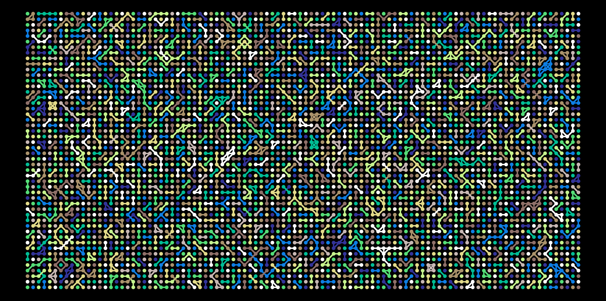
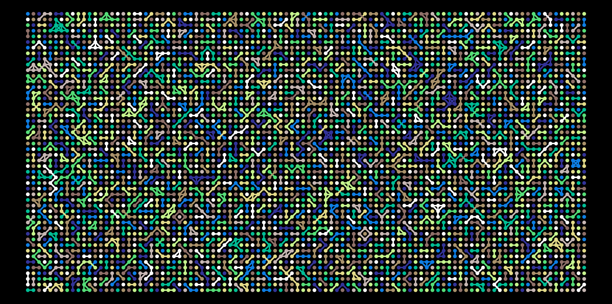

## In honor of pi-day

<h1 align="center">
  <br>
  
  <br>
  <br>
  
  <br>
  <br>
  
  <br>
</h1>

<h4 align="center">Grid visualization of a number's digits in python</h4>


## Introduction
In the image above, each dot represents a decimal, its position is on a meshgrid
and edges are drawn between nearest neighbors that have the same value

## Getting started

First write the digits of number (phi, pi or e) to file

```bash
$ python utils/save_number.py -h
$ python utils/save_number.py e 23 23
```

then run numart with the same arguments

```bash
$ python numart.py -h
$ python numart.py e 23 23 1
```

The digits generated by save_number are safely stored in data/
```
data/e_23_by_23.dat
data/phi_71_by_71.dat
data/pi_47_by_47.dat
```

and images are saved in images/

```
images/e_23_by_23.png
images/phi_71_by_71.png
images/pi_47_by_47.png
```

